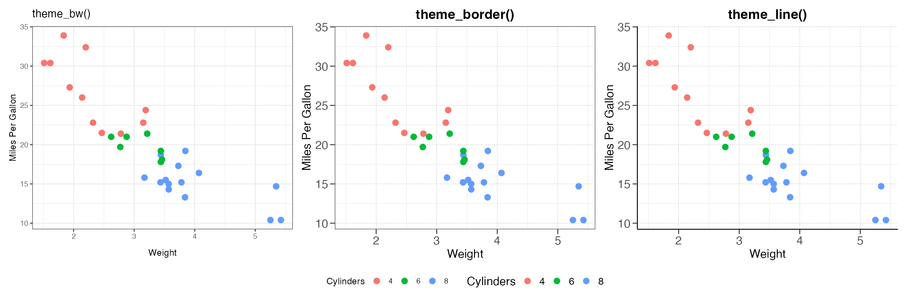
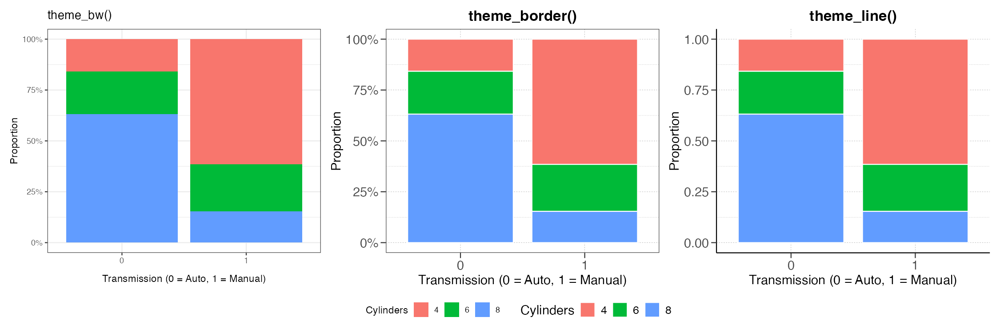

# plotr
[](https://github.com/hungms/plotr/actions)
[](https://github.com/hungms/plotr/actions)

`plotr` is an R package providing elegant themes and color palettes for data visualization with ggplot2.

## Documentation

For more details, visit the package website: [https://hungms.github.io/plotr/](https://hungms.github.io/plotr/)

## Features

### Theme Functions

`plotr` includes several theme functions to quickly style your ggplot2 visualizations:

* `theme_text()` - Typography settings with Helvetica font
* `theme_border()` - Clean border style
* `theme_line()` - Line-based theme with no border
* `theme_noaxisticks()` - Theme without axis ticks
* `theme_gridlines()` - Lighter gridlines styling
* `facet_aes()` - Enhanced facet_wrap aesthetics
* `umap_aes()` - Special aesthetics for dimension reduction plots

### Plot Functions

* `plot_percent()` - Create percentage/frequency bar plots with customizable grouping and faceting

### Color Palettes

Access various color palettes through the `get_palette()` function:

* Standard palettes like godsnot, zeileis
* WesAnderson-inspired palettes (Royal, Asteroid, Darjeeling, Zissou)
* Colorblind-friendly options (kelly, greenarmytage)
* Compatibility with RColorBrewer and viridis palettes


## Installation

```r
if (!require("devtools", quietly = TRUE))
    install.packages("devtools")
remotes::install_github("hungms/plotr")
```

## Dependencies
```r
# Install required packages from CRAN
install.packages(c("ggplot2", "dplyr", "magrittr", "stringr", "cowplot", "viridis", "ggrepel", "patchwork", "wesanderson", "RColorBrewer"))
```
`plotr` depends on the following packages:
* `ggplot2` - For creating graphics
* `dplyr` - For data manipulation in plot_percent()
* `magrittr` - For the pipe operator (%>%) used in data processing
* `stringr` - For string operations in get_palette()
* Supporting packages: cowplot, viridis, ggrepel, patchwork, wesanderson, RColorBrewer

## Example Comparison

`plotr` offers multiple theme options to suit different visualization needs, all providing enhanced aesthetics compared to the default ggplot2 themes:

Compare `theme_bw()` (default ggplot2), `theme_border()` and `theme_line()` (plotr):



Compare the same themes applied to bar charts:




## Usage Examples

### Scatter Plot with Custom Theme

```r
library(plotr)
library(ggplot2)

# Simple scatter plot with plotr theme
ggplot(mtcars, aes(x = wt, y = mpg, color = factor(cyl))) +
  geom_point(size = 3) +
  theme_line() + 
  theme_text() +
  scale_color_manual(values = c("#f3c300", "#875692", "#f38400")) +
  labs(title = "Car Weight vs MPG by Cylinders", 
       color = "Cylinders")
```

### Percentage Plot Example

```r
# Convert categorical variables to factors
mtcars$cyl <- as.factor(mtcars$cyl)
mtcars$am <- as.factor(mtcars$am)

# Create a proportion plot
ggplot(mtcars, aes(x = am, fill = cyl)) +
  geom_bar(position = "fill", width = 0.85, color = "white") +
  scale_y_continuous(labels = scales::percent) +
  scale_fill_viridis_d() +
  theme_line() +
  theme_text() +
  labs(x = "Transmission (0 = Automatic, 1 = Manual)",
       y = "Proportion",
       fill = "Cylinders") +
  ggtitle("Cylinders by Transmission Type")
```


## License

This package is released under the MIT License.
